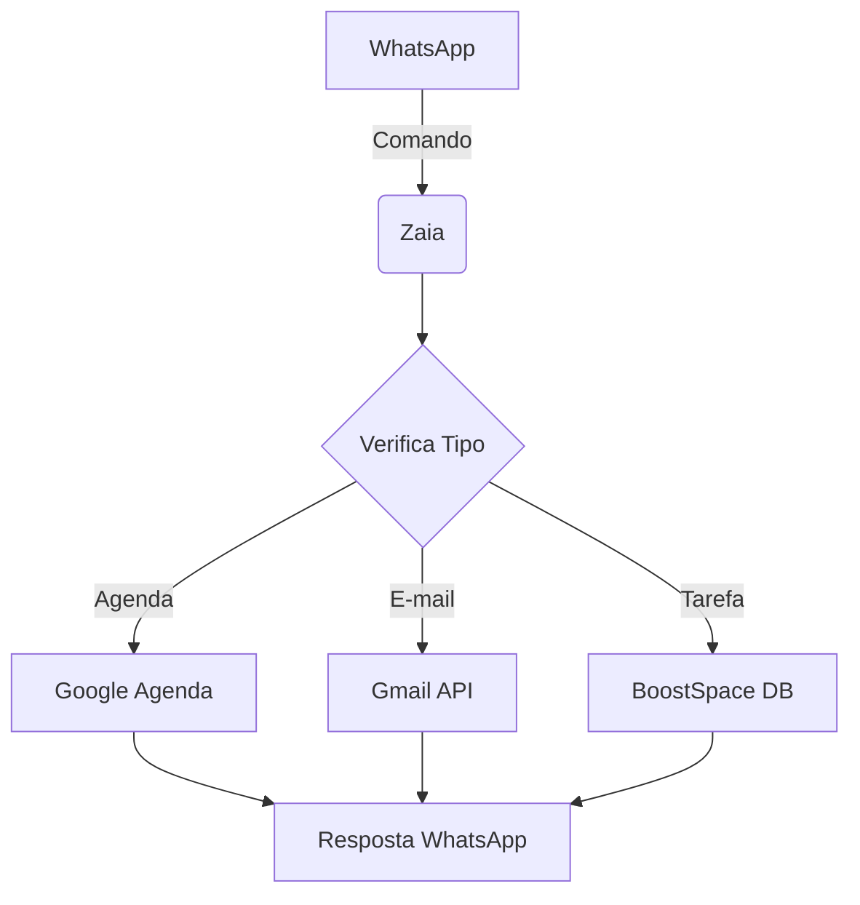
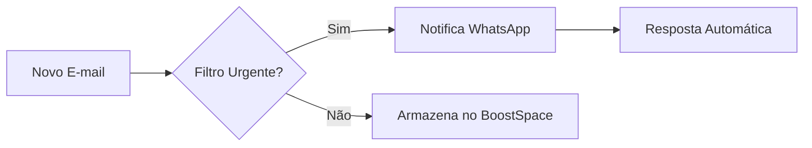

# 🔄 Diagramas de Fluxo (Mermaid)  

### **1. Conexões entre Zaia e BoostSpace**  


---




---  

# ⚙ Configurações no Zaia e BoostSpace  

### **Zaia (WhatsApp Automation)**  
1. **Criar Agente:**  
   - Acesse `app.zaia.ai` > Novo Agente.  
   - Vincule número WhatsApp (usando API Twilio/360Dialog).  

2. **Configurar Gatilhos:**  
   - `Quando: Mensagem recebida` → `Ação: Processar texto`.  
   - Exemplo:  
     ```yaml  
     if "marcar reunião" in mensagem:  
         criar_evento_agenda()  
     ```  

### **BoostSpace (Database de Tarefas)**  
1. **Criar Tabela:**  
   - Nome: `tarefas_pessoais`.  
   - Campos: `id, titulo, prioridade, status, data`.  

2. **Integrar com Zaia:**  
   - Usar webhook:  
     ```python  
     POST /boostspace/tarefas  
     Body: { "tarefa": "Revisar relatório", "prioridade": "alta" }  
     ```  
